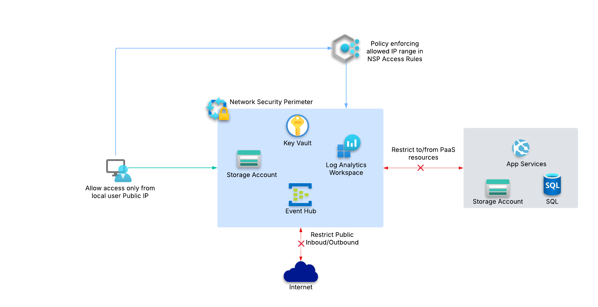

# 🔐 **Azure Network Security Perimeter**

# Contents
[Introduction](#introduction)

[Objectives](#objectives)

[Lab](#lab)

[Tasks](#tasks)

[Terraform-Documentation](#terraform-documentation)

## Introduction
Azure Network Security Perimeter(NSP) allows you to define a logical boundary around certain PaaS resources, ensuring network isolation and controlled access. For instance, in the past, we allowed Azure trusted services to access Key Vault. This meant any trusted services in the tenant could connect to Key Vault, making it less restrictive. Ofcourse, you still need RBAC permissions to retrieve the keys. From connectivity perspective, we can now ensure that only resources within a defined security perimeter can interact, eliminating broad connectivity to these services.

NSP also simplifies parent-child resource access control by centralizing access control at the network perimeter level, making it easier to deny all public access on the service level and explicitly allow only approved sources on NSP. Previously this wasnt possible in denying public access and allowing allowed IP list for these services via Azure Policy as the public access parameter is controlled in parent resources but the allowed IP list exists within a child resource and Azure Policy doesnt support multiple resource types with Deny/Modify effect.

## Objectives
After completing this, you will be able to :
- Understand about NSP
- Understand about centralized access control for PaaS services
- Query Log Analytics workspace and review NSP traffic

## Lab
The lab consists of Storage Account, Event Hub, Key Vault, Log Analytics Workspace and NSP. Key Vault will be used for Storage Account to enable encryption. Event Hub will be used to demonstrate centralized access control without enabling firewall access on the service level. Log Analytics workspace will be used for sending all of the NSP and service level logs.

📌 **NOTE** : The identity used to provision resources should have *Contributor* and *Role Based Access Control Administrator* permissions. If you are going to execute Task 5, you will need *Resource Policy Contributor* permissions as well.

## Tasks
> **Deploy the Required Resources**

Run the following command to deploy Storage Account, Key Vault, Event Hub and Log Analytics Workspace. After successful execution, you'll see all resources created.

`terraform apply -var "subscription_id=<your_subscription_id>"`

> **Enable Encryption Without NSP and Test EventHub**

Enable encryption for Storage Account by providing the key created in previous step and check if it can access Key Vault.

📌 **NOTE** : You can use POSTMAN and send event to Event Hub utilizing REST API's by following the link - https://learn.microsoft.com/en-us/rest/api/eventhub/send-event

`terraform apply -var "subscription_id=<your_subscription_id>" -var "enable_encryption=true"`

💡 **Expected result**: Encryption fails because Key Vault's public access is denied and Bypass Azure Services is not enabled. Event Hub gets access denied error as public access is disabled.

> **Enable NSP and secure the resources**

Create Network Security Perimeter and associate all resources to Network Security Perimeter Profile.

`terraform apply -var "subscription_id=<your_subscription_id>" -var "enable_NSP=true"`

> **Test Encryption & Event Hub**

Enable encryption now as NSP is configured and all resources are associated to the profile.

`terraform apply -var "subscription_id=<your_subscription_id>" -var "enable_NSP=true" -var "enable_encryption=true"`

💡 **Expected Result:** Encryption now works! The storage account is successfully able to retrieve the encryption key from Key Vault. Event Hub now works, because NSP automatically allows the local client's IP through the Terraform-defined inbound access rules.

> **(*OPTIONAL*) Configure Azure Policy for NSP**

This is totally optional but if you would like to ensure only allowed ip ranges are configured for inbound access rules in NSP. Once below command is run, try to update the inbound access rules by changing to a different IP range. 

`terraform apply -var "subscription_id=<your_subscription_id>" -var "enable_nsp=true" -var "enable_encryption=true" -var "configure_nsp_policy=true"`

💡 **Expected Result:** Azure Policy kicks in and ensures only allowed ranges mentioned in the policy is allowed.

> **Delete all resources**

Don't forget to clean up the resources.

`terraform destroy -var "subscription_id=<your_subscription_id>"`

## Terraform-Documentation

### Providers

| Name | Version |
|------|---------|
|  [azapi](#provider\_azapi) | 2.2.0 |
|  [azurerm](#provider\_azurerm) | 4.1.0 |
|  [http](#provider\_http) | 3.4.5 |

### Resources

| Name | Type |
|------|------|
| [azapi_resource.inbound_access_rules](https://registry.terraform.io/providers/azure/azapi/2.2.0/docs/resources/resource) | resource |
| [azapi_resource.nsp](https://registry.terraform.io/providers/azure/azapi/2.2.0/docs/resources/resource) | resource |
| [azapi_resource.nsp_profile](https://registry.terraform.io/providers/azure/azapi/2.2.0/docs/resources/resource) | resource |
| [azapi_resource.resource_associations](https://registry.terraform.io/providers/azure/azapi/2.2.0/docs/resources/resource) | resource |
| [azurerm_eventhub.eh](https://registry.terraform.io/providers/hashicorp/azurerm/4.1.0/docs/resources/eventhub) | resource |
| [azurerm_eventhub_namespace.ehn](https://registry.terraform.io/providers/hashicorp/azurerm/4.1.0/docs/resources/eventhub_namespace) | resource |
| [azurerm_key_vault.kv](https://registry.terraform.io/providers/hashicorp/azurerm/4.1.0/docs/resources/key_vault) | resource |
| [azurerm_key_vault_key.key](https://registry.terraform.io/providers/hashicorp/azurerm/4.1.0/docs/resources/key_vault_key) | resource |
| [azurerm_resource_group.rg](https://registry.terraform.io/providers/hashicorp/azurerm/4.1.0/docs/resources/resource_group) | resource |
| [azurerm_role_assignment.cmk_role_assignment](https://registry.terraform.io/providers/hashicorp/azurerm/4.1.0/docs/resources/role_assignment) | resource |
| [azurerm_role_assignment.key_role_assignment](https://registry.terraform.io/providers/hashicorp/azurerm/4.1.0/docs/resources/role_assignment) | resource |
| [azurerm_storage_account.sa](https://registry.terraform.io/providers/hashicorp/azurerm/4.1.0/docs/resources/storage_account) | resource |
| [azurerm_user_assigned_identity.uai](https://registry.terraform.io/providers/hashicorp/azurerm/4.1.0/docs/resources/user_assigned_identity) | resource |
| [azurerm_client_config.current](https://registry.terraform.io/providers/hashicorp/azurerm/4.1.0/docs/data-sources/client_config) | data source |
| [http_http.myip](https://registry.terraform.io/providers/hashicorp/http/latest/docs/data-sources/http) | data source |

### Inputs

| Name | Description | Type | Default | Required |
|------|-------------|------|---------|:--------:|
|  [enable\_encryption](#input\_enable\_encryption) | Enable encryption on storage account ? | `bool` | `false` | no |
|  [enable\_nsp](#input\_enable\_nsp) | Enabled Network Security Perimeter | `bool` | `false` | no |
|  [enable\_remote\_access](#input\_enable\_remote\_access) | Enable access to connect from local machine | `bool` | `false` | no |
|  [location](#input\_location) | Location of the resources that will be deployed in Azure | `string` | `"East US"` | no |
|  [subscription\_id](#input\_subscription\_id) | ID of the subscription where the resources will be deployed | `string` | n/a | yes |
|  [configure\_nsp\_policy](#input\_sconfigure\_nsp\_policy) | Configure Azure Policy for NSP Access Rules ? | `bool` | `false` | no |